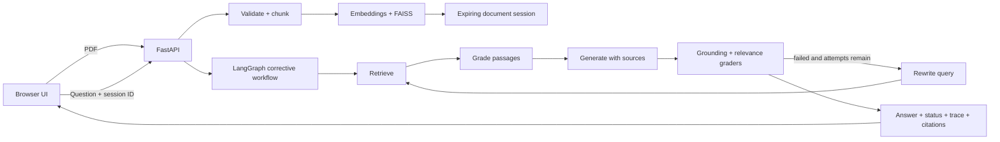

# Self-Correcting RAG for Docs

[](https://github.com/Bharathkondur/Self-Correcting-RAG-for-Docs/actions/workflows/ci.yml)
[](https://www.python.org/)
[](https://fastapi.tiangolo.com/)
[](LICENSE)

A document-question answering application that does not silently trust its first result. It grades
retrieved passages, checks whether an answer is grounded and relevant, rewrites weak queries, and
retries through retrieval—while exposing the real decision trace and page-level evidence.

This repository is an engineering-focused portfolio project. Claims are intentionally limited to
behaviour covered by automated tests; model quality and latency depend on the selected provider and
document corpus.

## Why this is more than “chat with a PDF”

- **Bounded corrective workflow:** every retry path stops at `MAX_ATTEMPTS`; no infinite graph loops.
- **Structured grading:** graders return validated `yes`/`no` objects instead of fragile substring checks.
- **Evidence-first responses:** answers are prompted with numbered sources and the API returns filename,
  page, and excerpt for every supporting chunk.
- **Honest outcomes:** results are labelled `passed`, `best_effort`, or `no_context`; reaching the retry
  limit is never presented as successful verification.
- **Session isolation:** each upload receives an expiring UUID and cannot overwrite another user's graph.
- **Testable design:** LLM operations are separated from graph routing, so every correction branch is
  tested deterministically without paid API calls.
- **Hosted or local models:** use OpenAI or run chat and embeddings locally with Ollama.

## Architecture



### Correction contract

1. Retrieve candidate passages for the current query.
2. Remove passages that fail structured relevance grading.
3. If no passage survives, rewrite the query and retrieve again.
4. Generate an answer from numbered, untrusted source blocks.
5. Independently grade grounding and whether the original question was answered.
6. Return a verified answer, retry through retrieval, or clearly label the final result as best effort.

The original user question is retained throughout the graph. A rewritten retrieval query never changes
the intent used by the final answer-relevance grader.

## Quick start

### Option A: OpenAI

```bash
git clone https://github.com/Bharathkondur/Self-Correcting-RAG-for-Docs.git
cd Self-Correcting-RAG-for-Docs
python -m venv .venv
```

Activate the environment:

```bash
# Linux/macOS
source .venv/bin/activate

# Windows PowerShell
.venv\Scripts\Activate.ps1
```

Install and configure:

```bash
pip install -r backend/requirements.txt
cp backend/.env.example backend/.env  # Windows: copy backend\.env.example backend\.env
```

Set `OPENAI_API_KEY` in `backend/.env`, then run:

```bash
python -m backend.app
```

Open [http://localhost:8000](http://localhost:8000). Interactive API documentation is available at
[http://localhost:8000/docs](http://localhost:8000/docs).

### Option B: fully local with Ollama

```bash
ollama pull mistral
ollama pull nomic-embed-text
```

Leave `OPENAI_API_KEY` empty, confirm `OLLAMA_BASE_URL`, and start the application as above.

### Docker

```bash
# PowerShell
$env:OPENAI_API_KEY="your-key"
docker compose up --build

# Linux/macOS
OPENAI_API_KEY="your-key" docker compose up --build
```

Secrets and uploaded PDFs are excluded from the Docker build context.

## API

| Endpoint | Purpose |
|---|---|
| `GET /api/health` | Readiness, version, and configured provider |
| `POST /api/documents` | Validate, chunk, embed, and create an isolated session |
| `POST /api/chat` | Run the corrective graph for a session |
| `DELETE /api/documents/{session_id}` | Remove a document session early |

Example chat request:

```json
{
  "session_id": "f43dc528-0b20-46da-a3bd-b1f701675ba2",
  "question": "What safeguards does the document recommend?",
  "temperature": 0.2
}
```

The response contains the answer, verification status, actual retrieval attempt count, full graph trace,
final retrieval query, and source excerpts with page numbers.

## Tests and quality checks

Tests use deterministic fake retrievers and LLM services, so CI needs no API key:

```bash
pip install -r backend/requirements.txt -r requirements-dev.txt
ruff check backend tests
pytest
```

Covered behaviour includes:

- Successful one-pass verification and page citations
- Failed grounding followed by query rewrite, retrieval, and successful verification
- No-context termination at the exact retry limit
- Honest `best_effort` status after exhausted retries
- PDF validation, missing/expired sessions, session isolation, chat responses, and health checks
- Session creation, lookup, and deletion

GitHub Actions runs linting, tests with a coverage threshold, and package validation on every pull request.

### Reproducible model-quality evaluation

After starting the API, generate the included sample document and run the labelled evaluation set:

```bash
python make_pdf.py
python evaluation/evaluate.py --pdf test.pdf
```

The harness reports status accuracy, expected-term recall, citation-page accuracy, mean latency, p95
latency, and attempts per question. Results are printed rather than hard-coded into this README so model
or prompt changes cannot leave behind misleading benchmark claims. For a real use case, replace the small
sample dataset with domain-expert questions before comparing baseline and corrective configurations.

## Configuration

All settings are documented in [`backend/.env.example`](backend/.env.example). Important options:

| Variable | Default | Purpose |
|---|---:|---|
| `ANSWER_MODEL` | `gpt-4o-mini` | Answer generation and query rewriting |
| `GRADER_MODEL` | `gpt-4o-mini` | Structured relevance and grounding grades |
| `EMBEDDING_MODEL` | `text-embedding-3-small` | Hosted embedding model |
| `MAX_ATTEMPTS` | `3` | Hard limit across all retrieval attempts |
| `MAX_UPLOAD_MB` | `20` | Upload protection |
| `SESSION_TTL_SECONDS` | `3600` | In-memory session lifetime |
| `RETRIEVAL_K` | `4` | Candidate passages per attempt |
| `CORS_ORIGINS` | `http://localhost:8000` | Comma-separated allowed web origins |

## Security and reliability decisions

- Uploaded names are reduced to their basename; random OS temporary files are always removed in `finally`.
- Extension, PDF signature, extractable text, and upload size are validated before indexing.
- Source documents are explicitly treated as untrusted prompt data to reduce prompt-injection risk.
- Browser content is rendered through `textContent`, not unsanitized `innerHTML`.
- Internal exceptions are logged server-side while clients receive non-sensitive errors.
- Blocking parsing, embedding, and graph operations run in worker threads rather than blocking FastAPI's
  event loop.
- CORS is allow-listed and credentials are disabled.

## Current scope and production path

The included `SessionStore` deliberately targets a single-process demo. A horizontally scaled deployment
should replace it with Redis-backed session metadata and durable vector storage. Additional production
work would include authentication, per-user quotas, malware scanning, observability, and a corpus-specific
quality evaluation before an SLA is claimed.

This explicit boundary is intentional: the project demonstrates production-aware design without claiming
untested scale or accuracy.

### Deliberate trade-offs

- LLM grading is more interpretable than a raw similarity threshold, but it adds latency and token cost.
- In-memory FAISS makes the demo private and easy to run, but indices disappear on restart.
- Vanilla JavaScript keeps the client small; a larger product would benefit from typed generated API clients.
- Page-level citations improve auditability, but scanned PDFs still require a separate OCR pipeline.

## Repository layout

```text
backend/
  app.py             Secure API, ingestion, and response models
  config.py          Typed environment configuration
  rag_graph.py       Corrective LangGraph workflow and LLM services
  session_store.py   Thread-safe expiring document sessions
frontend/
  index.html         Accessible single-page interface
  script.js          Safe API client, trace, sources, and export
  style.css          Responsive UI
tests/               Deterministic graph, API, and session tests
evaluation/          Labelled sample set and live quality/latency harness
.github/workflows/   CI pipeline
```

## License

[MIT](LICENSE)
